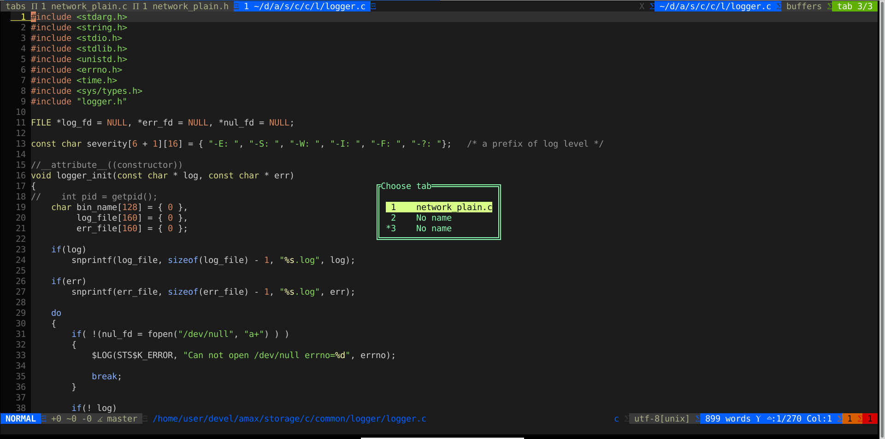
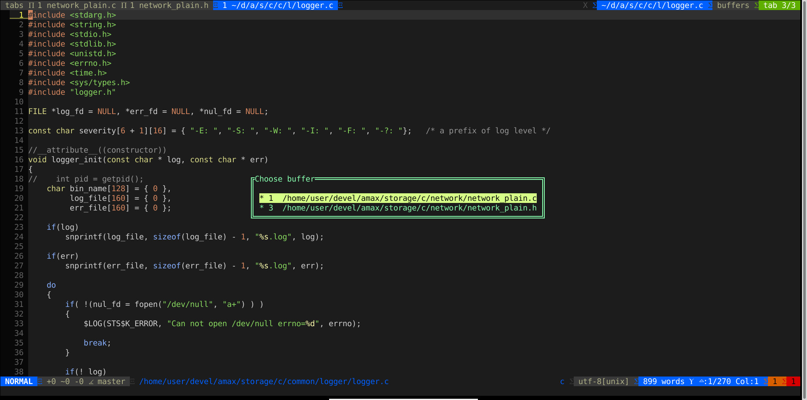

# vim_popup_tabs

This module adds switching between tabs and buffers to vim using popup dialog menu

 
Tabs popup menu 
 
 
Buffers popup menu 
 

Bugs:
 - Fill buffer name only when open vim to file edit
